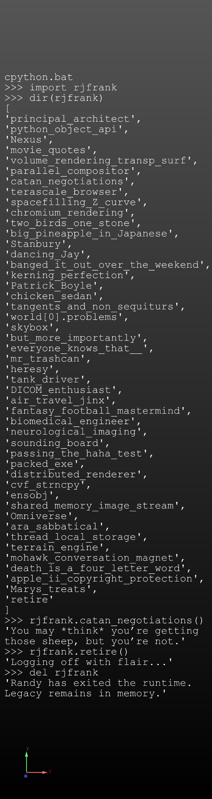

# rjfrank

🎉 An honorary Python module celebrating Randy Frank's legendary contributions.

This playful module includes memorable quotes, fun attributes, and a stylish farewell message when removed from runtime.

---

## Install

```bash
pip install rjfrank
```

## Usage

```python
import rjfrank

print(rjfrank.catan_negotiations())
print(rjfrank.movie_quotes())
print(rjfrank.retire())

del rjfrank
```

---

## License

MIT License

---

## Credits

This project was inspired by an idea from **David Bremer** to honor **Randy Frank**.


